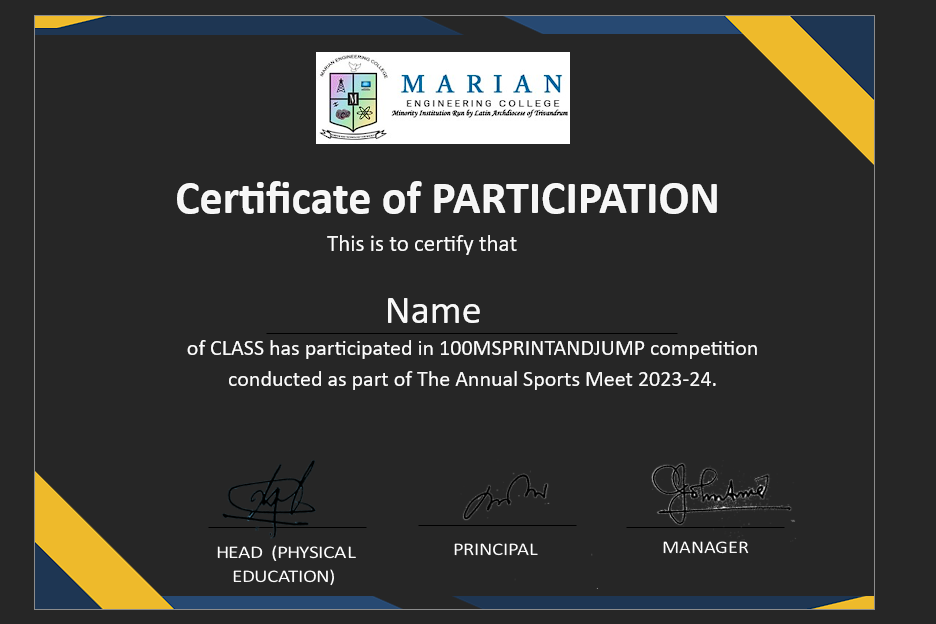
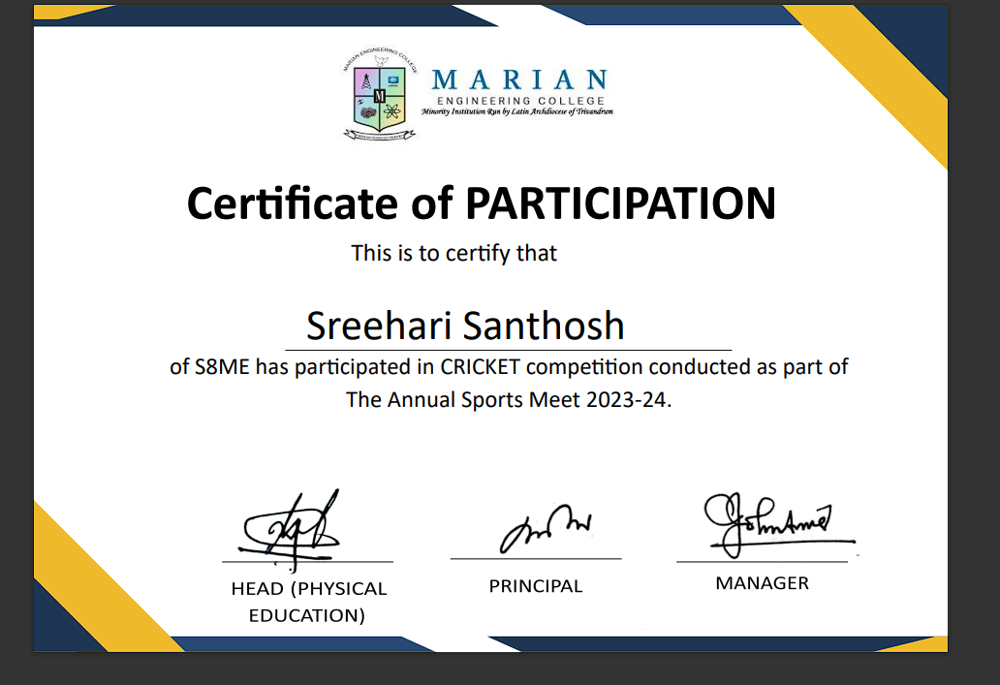

# Automated Certificate Generator

This program is developed by Sreedev TS to automate the process of generating certificates. It is built using Python and utilizes libraries such as OS, csv, docx, etc.

## Features

- Generates certificates automatically from a template.
- Substitutes values for Name, Class, Semester, and Event from a CSV file.
- Converts the generated Word documents to PDF format.

## Requirements

- Python 3.x
- Required Python libraries: `os`, `csv`, `docx`, `docx2pdf`

## Usage

1. Clone the repository:

```
git clone https://github.com/sreedevts/automated-certificate-generator.git
```

2. Place your certificate template as `template.docx` in the project directory.

3. Place your CSV file with the data (containing columns Name, Class, Semester, Event) in the directory `student_data`.

4. Run the program:

```
python certificate_generator.py
```

5. Find your generated certificates in the `Final_Certificates` directory.

## Modification

If you need to modify the certificate template, make sure to leave the placeholders `NAME`, `CLASS`, `SEM`, and `EVENT` where the values need to be substituted. With minimal experience, you can modify the code to suit your use case.
This is the template

This is the final result


## Note

This program was created to automate the certificate designing process for my college. No coding experience is needed to use this program, just basic understanding.I just built to automate design which was supposed to be done by me manually.
Make sure to leave the words `NAME`, `CLASS`, `SEM`, and `EVENT` where the values need to be substituted.

## Support

For any issues or queries, feel free to contact Sreedev TS at [sreedevts@example.com](mailto:xreedev@gmail.com).

Enjoy automating your certificate generation process!
